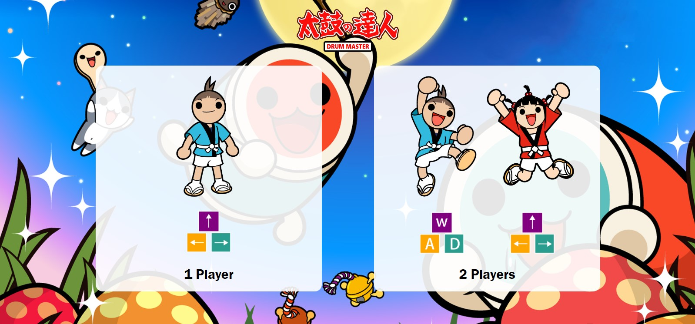
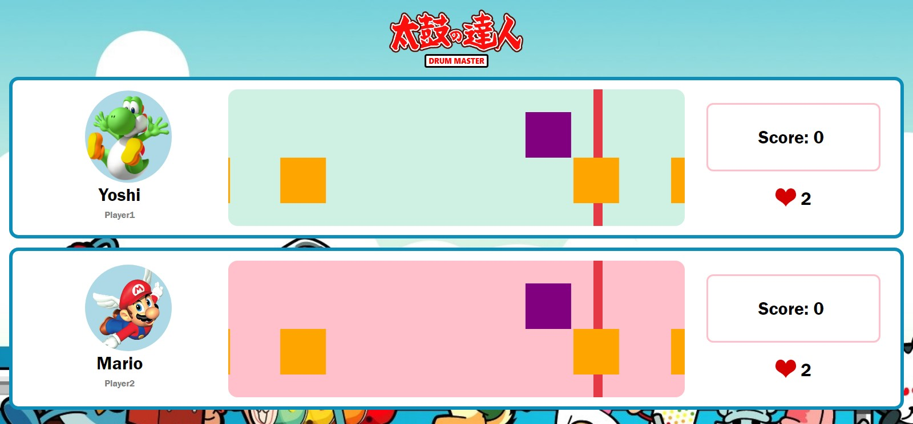

<h1 align="center"> GAME MASTER</h1>

<h2 align="center">open-source web-based online rhythm game</h2>

**Drum Master** is an open-source, online, web-based rhythm game written in HTML, CSS, and JavaScript. It is recommended to play this game on Google Chrome.

The song's name is "Butterfly" performed by Kōji Wada, which was used as the original Japanese opening theme to Digimon Adventure.

**Table of contents:**

- [Getting Started](#getting-started)
- [Video Demo](#video-demo)
- [Quick Tour](#quick-tour)
- [Unsolved Problem](#unsolved-problem)
- [Contributing](#contributing)
- [License](#license)

## Getting Started

Visit [this page](https://sunnydreamer.github.io/drum-master-game/) to play the game.

## Video Demo

## Quick Tour

- **Player Mode Selection** enables players to pick from **1-player mode** or **2-player mode**.

- Play along the music with your **keyboard**. 3 keys for each player.

- **1 Player Mode** gives you a chance to hit the highest score in your record.

- Player together with friends using **2-player mode**. It helps you start the game at the same time.

- **Fully key-sounded.** Each note has its own sound. The music will be decorated by your gameplay.

- **Health Count Down**. Each player will have 5 life points per game. If they miss the note, 1 point will drop. Game over if the life goes to 0.

- **Scoring and grading system.**
  Master the song to get your personal best score or defeat your friend by a higher score.

## Unsolved Problem

- **Multiple difficulties.** Each song has multiple difficulties to accommodate every player's skill level. For example, adjustable speed, different note placement, or different life points.

- **More Song Choices.** Import more songs into the game.

- **Accuracy.** Import accuracy grades, such as grades A, B, C, S, and S++.

## Contributing

When contributing to this repository, please first discuss the change you wish to
make via issue, email, or any other method with the owners of this repository
before making a change.

## License

This project is licensed under the MIT License - see the LICENSE file for details.

MIT © Sunny Dreamer
